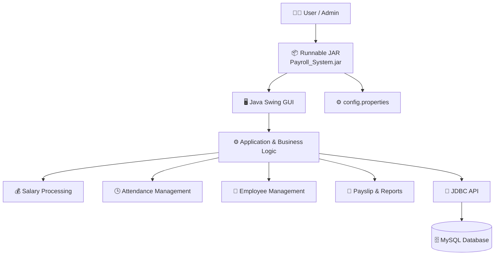
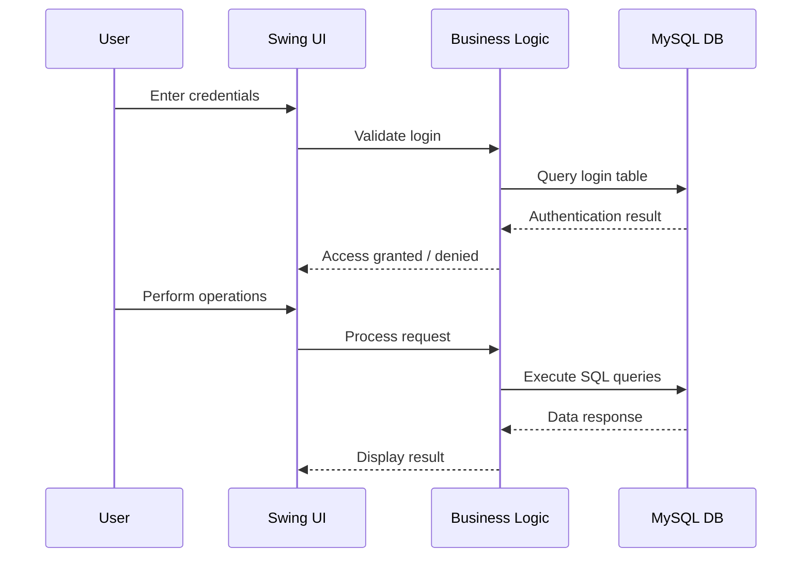

# 💼 Employee Payroll Management System

[](https://github.com/sayaligurav7789/Emp_Payroll/releases)

An automated Java-based system to manage employee information, track attendance, calculate salaries, and generate payslips — designed to simplify payroll operations and reduce manual errors.

---

## 🚩 Problem Statement

To design and implement a Java-based **Employee Payroll Management System** that automates:

* Employee information management  
* Salary calculation  
* Attendance tracking  
* Payslip and report generation  

This minimizes manual effort and reduces errors in payroll processing.

---

## 📌 Introduction

Payroll management is a core function in every organization. When handled manually, it becomes time-consuming and prone to errors.

This system provides an automated solution for:

* 📋 Digital employee data entry  
* 💰 Salary and attendance tracking  
* 🧾 Payslip generation  

It is developed using **Java Swing** for the GUI, **Java** for business logic, **JDBC** for database connectivity, and **MySQL** for data storage. Integrated utilities like **Notepad**, **Calculator**, and **Chrome Browser** add convenience, making it a complete administrative tool.

---

## 🛠️ Tech Stack

| Layer | Technology | Description |
|------|-----------|-------------|
| 🎨 Frontend | Java Swing | Desktop GUI for user interaction |
| ⚙️ Backend | Java | Business logic & application flow |
| 🔌 Data Access | JDBC | Database connectivity layer |
| 🗄️ Database | MySQL | Relational data storage |
| 📦 Deployment | Runnable JAR | Packaged desktop application |

---

## 🌐 System Architecture

The **Employee Payroll Management System** follows a **layered architecture**, ensuring clear separation of concerns, maintainability, and scalability.

---

### 🔹 High-Level Architecture Diagram



---

### 🔹 Application Workflow


---

## ⚙️ Working of the System

### 1. Master Tab
* **New Employee Entry** – Input and save personal details  
* **Salary Entry** – Assign components: Basic, HRA, DA, MED, PF  
* **List Employee** – View all employee records  

### 2. Update Tab
* **Update Employee** – Edit employee information  
* **Update Salary** – Modify salary components  
* **Take Attendance** – Mark Present, Half Day, or Leave  

### 3. Report Tab
* **Generate Payslip** – View breakdown of salary, tax, and net amount  
* **List Attendance** – Display monthly/periodic attendance  

### 4. Utilities Tab
* **Notepad** – Open text editor  
* **Calculator** – For manual calculations  
* **Chrome** – Launch browser  

### 5. Exit Tab
* Prompts to save unsaved changes before exiting  

---

## 💰 Salary Calculation Logic

```

Gross Salary = Basic + HRA + DA + MED + PF
Tax = 2.1% of Gross Salary
Net Salary = Gross Salary - Tax

````

📌**Example**:  
If all components are ₹1000:
* Gross Salary = ₹5000  
* Tax = 2.1% of ₹5000 = ₹105  
* Net Salary = ₹4895

---

## 🖼️ Snapshots

### ✅ Login 


---

### ✅ Dashboard  


---

### ✅ Employee Registration 


---
### ✅ View Employee


---
### ✅ Payslip Generation 


---

### ✅ Attendance List  


---

### ✅ Key Functional Tabs


---

## ⚙️ Configuration (Required)

Before running the application, create a file named **`config.properties`**
in the same directory as `Payroll_System.jar`.

### 📌 Example `config.properties`
```properties
db.url=jdbc:mysql://localhost:3306/payroll
db.user=YOUR_DB_USERNAME
db.password=YOUR_DB_PASSWORD
```

### 📌 Ensure that:

- MySQL service is running
- Database name matches (payroll)
- Credentials are valid
---

## ▶️ How to Run

1. Download the runnable JAR from GitHub Releases  
2. Place `config.properties` beside the JAR  
3. Open terminal / command prompt in that folder  
4. Run:

```bash
java -jar Payroll_System.jar
```
---

## 🔐 Demo Login Credentials

| Username | Password |
|--------|----------|
| admin  | admin    |

⚠️ For demonstration purposes only.  
Credentials can be modified directly in the `login` table.

---

## 🗄️ Database Schema (Core Tables)

| Table Name | Description |
|----------|-------------|
| `login` | User authentication |
| `employee` | Employee personal details |
| `salary` | Salary components |
| `attendance` | Attendance records |

---

## 🔐 Security Considerations

- Database credentials are externalized using `config.properties`
- Sensitive configuration files are ignored via `.gitignore`
- Prevents credential exposure in public repositories

---

## 🚀 Key Highlights

✔ Modular layered architecture  
✔ Externalized database configuration  
✔ Runnable JAR deployment  
✔ Clean Swing-based UI  
✔ Real-time MySQL integration  
✔ Interview & resume ready project

---


## 👩‍💻 Author
### **Sayali Gurav 🌱**
 Computer Science Engineer 

---

🔗 **Connect with me**

[](https://github.com/sayaligurav7789)
[](https://linkedin.com/in/sayali-gurav-9a3a302a5)
[](https://sayali-gurav7789-portfolio.vercel.app)
[](https://leetcode.com/sayaliGurav)
[](mailto:sayligurab7789@gmail.com)

---

### ⭐ **Like This?** 
Don’t forget to give this repository a star - it really helps! 🌱


